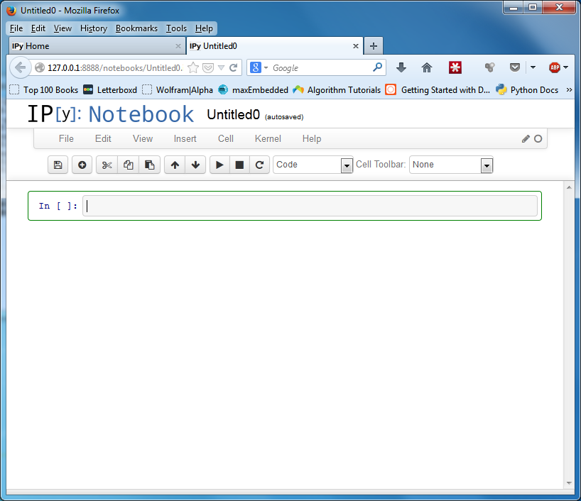

% A Quick Introduction to Python
% Prepared by Assil Taoufik Ksiksi
% March 2014


\newpage
\tableofcontents
\newpage

# Introduction

## What is Python?

"Python is a widely used general-purpose, high-level programming language. Its design philosophy emphasizes code readability, and its syntax allows programmers to express concepts in fewer lines of code than would be possible in languages such as C. The language provides constructs intended to enable clear programs on both a small and large scale.

Python supports multiple programming paradigms, including object-oriented, imperative and functional programming or procedural styles. It features a dynamic type system and automatic memory management and has a large and comprehensive standard library."[^1]

[^1]: Python (programming language) - [https://en.wikipedia.org/wiki/Python_%28programming_language%29](http://en.wikipedia.org/wiki/Python_%28programming_language%29)

Woah. What an earful. How about we break down the above summary into its key points?

* **General-purpose** - Python can be used for many different things, including, but of course not limited to:
	* Web development
	* Scientific computing
	* Game development
	* Mobile app development
	* Data science and machine learning
	* Scripting and automation
	* Visualization
	* Networking
	* Concurrent applications
* **High-level** - This means that Python is (literally) a level above the "low-level" languages, such as C.
* **Code readability** - Python code is generally pleasureable to look at due to its whitespace-based indentation.
* **Multiple programming paradigms** - In other words, versatility. For comparison, C is a purely imperative language i.e. instructions are defined sequentially.
* **Dynamic type system** - Simply put, in Python, you do not need to declare variables or specify their types before using them.
* **Large standard library** - Almost anything you can think of can be done using the included standard library modules. Everything else can be achieved using external packages.

## Python in the Real World

OK, so Python is a cool language, but where is it really used? Below is a list of known websites and games, both global and from the region, that use Python.

* [Dropbox](http://www.dropbox.com/) - The Dropbox client is written in Python.
* [Google](http://www.google.com/) - Google uses Python in its search engine stack. The creator of Python used to work there until two years ago.
* [Disqus](http://www.disqus.com/) - Almost every blog in the world uses Disqus for their comments.
* [Instagram](http://www.instagram.com/) - Reportedly written in Django, a web framework for Python.
* [Dubizzle](http://www.dubizzle.com/) - One of the biggest classified ads websites in the Middle East. Built using Django. Uses Python extensively.
* [Reddit](http://www.reddit.com/) - Written in Python. The website is actually open-source.
* [The Washington Post](http://www.washingtonpost.com/)
* [Civilization IV](http://en.wikipedia.org/wiki/Civilization_IV) - Used Python for its AI engine.
* [EVE Online](http://www.eveonline.com/) - The server code for EVE is written in a modified Python language called [Stackless Python](http://www.stackless.com/).
* [Blender 3D](http://www.blender.org/) - Python is the language used for extending Blender.

## Note: Python 2 vs. Python 3

Python 3 was released in 2008. The goal behind it was to fix some fundamental flaws with the Python language. The problem, however, was that these changes could not be backwards compatible. The community was fragmented as a result. To this day, many people still use Python 2. In this workshop, I'll be uisng Python 3, since it is the future of Python.

## The Workshop

### Target Audience

This workshop assumes that you have a bit of experience working with another programming language, such as C or Java. If you don't, you may have some difficulty keeping up.

### Workshop Material

The workshop material is open-source (yay!) and has its own [repository](https://github.com/Cyph0n/python-workshop-2014) on Github[^2]. You can use [this](https://github.com/Cyph0n/python-workshop-2014/archive/master.zip) link to grab the latest version of the outline PDF as a `.zip` file.

[^2]: Github on Wikipedia - [https://en.wikipedia.org/wiki/GitHub](https://en.wikipedia.org/wiki/GitHub)

### About the Presenter

His name is Assil Taoufik Ksiksi, and he's a 3rd year UAEU student currently pursuing a degree in Electrical Engineering. He taught himself programming 4 years ago, starting with C/C++, and has been writing Python for the past 2 years. He likes to refer to himself as an intermediate Python developer.

His main passion is web development, and he uses Python for that as well. His last "cool" project was a course scheduling web application for UAEU students called [Jadawil](http://jadawil.co.nr/). He still updates it at the end of every semester, but he probably won't be adding any new features. The web app is written in [Flask](http://flask.pocoo.org/), a web microframework for Python.

### The Workshop's Timing

Believe it or not, but the most suitable time for the workshop was found using real UAEU course data and Python. The code ranked the time slots of UAEU courses from least conflicts to most conflicts. In other words, it determined how many times each time slot overlapped with the rest.

You can find the IPython notebook [here](http://nbviewer.ipython.org/gist/Cyph0n/9280508).

# Section 0. Setting Up the Environment

## 1. Installing Miniconda

Miniconda is a custom installer for Python that simplifies the installation of Python libraries. It is available for all major operating systems and works pretty much the same across them all, making troubleshooting less of a problem.

To download Miniconda, visit its [Downloads](http://conda.pydata.org/miniconda.html#miniconda) page. Select the **Python 3** version corresponding to your operating system. The installation process is quite straightforward. Do not change any of the options during the installation, except perhaps the installation directory.

To verify that Python was installed correctly, type `python --version` in the command prompt on Windows or the terminal on OS X/Linux. If you don't get an error, you're good to go.


## 2. Creating a Directory

Create a directory for the workshop. We'll be saving our work in this directory. An example could be `py-workshop` on the Desktop. Navigate to this directory using your prompt's `cd` command before proceeding.


## 3. The `IPython` Notebook Interface

`IPython` is a special version of Python that adds a good amount of useful features to the Python interpreter. In addition, it comes with a Notebook version that allows you to interactively run your code in a web browser. Since Python is a dynamic language, you do not need to compile your code - simply type the code in a block and hit `Shift-Enter` to view the results of the execution instantly.

`IPython` also allows you to include images, text, LaTeX-formatted equations, and even video along with your code *in the same notebook*. More details can be found in the `IPython` [documentation](http://ipython.org/ipython-doc/stable/interactive/notebook.html).

First, you'll need to install `IPython` in Miniconda. To do this, you can use the built-in `conda` command line package installer.

1. Open a Command Prompt and type `conda install ipython pyzmq jinja2 tornado`. These are the Python packages needed to run `IPython` correctly.


2. Type `y` and hit `Enter` when asked to proceed.
3. Wait for everything to finish installing.

To start up an instance of the `IPython` Notebook server, type `ipython notebook` in your terminal. This will automatically open the `IPython` Notebook dashboard page in your default web browser. To stop the server, hit `Ctrl-C`.

Create a new notebook. It will be saved in the current working directory.

\newpage




\newpage

# Section 1. Variables, Types, and User Input

## Variables and Types

Unlike in C or Java, variables in Python are not declared beforehand. This is due to dynamic typing, which basically means that the interpreter determines the type of a variable at runtime. Of course, there are types, and the main ones are `int`, `float`, `string`, `list`, `bool`, and `dict`. There is no `char` type - you can use a `string` instead.

The following is some simple code that demonstrates the manipulation of variables of different types. Try to predict the output of each `print` statement before running anything. Notice that string formatting in Python uses C's format specifier system.

```python
# Setup some variables of different types
a = 5
b = 12.0
c = 'apple'
d = True
e = [1, 5.0, False, 'orange']

# Simple operations and access
print((a + 10) ** 2)
print('Value = %f' % (b * a))
print(c + ' ' + c)
print(d)
print(e[1], e[-1])
```

## User Input

In Python, taking user input is extremely simple thanks to the `input` function. The function takes an optional message to display to the user and returns the entered value as a `string`. To get a number, you'll need to convert the input from `string` to `int` or `float`.

```python
# Take user input
name = input('Enter your name: ')
print('Hello, %s!' % name)

# Type conversion in action
num = int(input()) # Must input an integer!
print('You entered %d.' % num)
```

\newpage

# Section 2. Flow Control and Looping

We have mentioned already that Python is a whitespace-based language, so proper indentation is extremely important. As you can see in the following examples, whitespace defines which code lies in which block. Think of it as a replacement for the curly braces in C.

## The `if` Statement

The syntax for the `if` statement is very similar to its syntax in C. The only difference is the use of `elif` instead of `else if`.

```python
# Simple if-elif-else block
if a < 5:
    print('Less.')
    print('Still here.')
elif a == 5:
    print('Equal.')

    if a != 5:
        print('Impossible, right?')
else:
    print('Greater.')
```

## The `for` Loop

The `for` loop in Python is quite different however. It is much more concise, and is used to iterate over a list instead of incrementing a counter. 

The list used by the loop can be user-defined or generated using a built-in function like `range`, which generates a list of `int`s. On each iteration of the loop, the variable is assigned to an item in the list in sequential order.

```python
# Append some items to the list, then iterate over it
e.append('mango')
e.append(33.5)

for item in e:
	print e

# Iterate over a range of numbers (1-10)
m = 10

for i in range(1, m+1):
	print(i)
```

## The `while` Loop

The `while` loop is basically the same, and is used mainly for sentinel loops in Python, as shown below.

```python
# Simple while loop
i = 0
condition = True

while condition:
	if i == 5:
		condition = False
		continue
	
	print('Iteration: %d' % i)
	
	i += 1
```

# Section 3. Functions and File I/O

## Functions

Due to the dynamic type system, functions do not need a return type or types for their argument(s). This makes writing functions much easier, since you do not have to worry about types. Unfortunately, that's not always a good thing, but we'll leave that for another time.

```python
# Print something
def printer():
	print('Something?')

# Add two numbers
def add(x, y):
	return x + y

# Greeting with default name
def greeting(name='world'):
	return 'Hello, %s!' % name
```

The function calling syntax is exactly the same as it is in C.

```python
printer()
s = add(10, 20)
t = greeting()
u = greeting('Assil')

print(s)
print(t)
print(u)
```

## File Input and Output

Working with files is very easy in Python (see the pattern?), as demonstrated by the following examples. To create a new `file` object, we use the built-in `open` function. After you're done working with the file, it is advisable to call its `close` method.

```python
# Create a new file in current directory and write 1-10 on seperate lines
f = open('nums.txt', 'w')

for i in range(1, 11):
	f.write('%d\n' % i)

f.close()
```

```python
# Open above file for reading
f = open('nums.txt')

# Iterate over its lines
for line in f:
    print(line.strip('\n')) # Strip off newline before printing

f.close()
```

# Section 4. Imports and The Standard Library

For this part, you'll need to create a Python script. On Unix, simply type `touch test.py` in the terminal. On Windows, type `echo "" > test.py` in the command prompt.

Open `test.py` in any text editor, and type the following into it:

```python
def add(x, y):
	return x + y

a = 15
b = 'apple'
```

Save `test.py` and close it. Go back to your `IPython` notebook. 

We'll be using the variables and function defined in `test.py` in our notebook. This is accomplished by using the `import` statement. As you can see, the statement is used to import built-in Python libraries as well, so be careful with the filename i.e. don't call your external script `math.py`.

```python
# Import from the standard library
import math
from math import pi

# Import external Python script
import test

# Get variables from external script
a = test.a
b = test.b

print(a, b)

n = test.add(a, a*2)
p = math.sqrt(a)
q = math.pow(pi, 2)

print(n, p, q)
```

# Project: Webpage Downloader

The project combines everything covered above to create a relatively useful Python application. This application will do the following:

1. Ask the user to enter the URL of a valid website.
2. Ask the user for a filename for the downloaded HTML file. The file will be saved in the `downloads` folder in the script's directory.
3. Download the contents of the website's homepage in HTML and save it to the given file.
4. Tell the user that the process is complete and show the path to the downloaded file.

Make sure to create the `downloads` directory before continuing.

## Implementation

Before writing any code, let's write comments to define the layout of our script. It's good practice usually, and helps you organize your thinking as you work.

```python
# Function: get_html(url) -> given a URL, returns HTML content of page as a string


# Prompts for the user: URL and filename


# full_path = 'downloads/' + filename + '.html'


# Create a new HTML file at the given path


# Get the webpage's contents using the `get_html` function


# Write the downloaded HTML to the file and then close the file object


# Tell the user the file has been saved and print the file's path


```

Let's start filling in the code for each comment, starting with the prompts. Keep the `get_html` function definition until the end.

For the prompts, we need the user to enter two things: the URL and the filename. That means two variables and two `input` calls. Since this is a simple application, we'll leave the error handling to the user by including the input specification in the prompts.

```python
# Prompts for the user: URL and filename
url = input('Enter a URL (without http://): ')
filename = input('Enter a filename (no spaces): ')
```

Next, we add the folder name (`downloads` in this case), the filename, and the `.html` extension to get the full path. We can do this because all three values are of type `string`.

```python
# full_path = folder_name + filename + file_extension
full_path = 'downloads/' + filename + '.html'
```

Now we create the HTML file. Make sure to set the mode to `w` (write).

```python
# Create a new HTML file at the given path
f = open(full_path, 'w')
```

Here's the important part. For the time being, we'll just insert a call to `get_html`, which we'll define in a moment.

```python
# Get the webpage's contents using the `get_html` function
html = get_html(url)
```

The last two parts are straightforward. Notice that string formatting can be done even before the `print` statement.

```python
# Write the downloaded HTML to the file and then close the file object
f.write(html)
f.close()

# Tell the user the file has been saved and print the file's path
message = 'Done! File saved at: %s' % full_path
print(message)
```

Lastly, we need to implement `get_html`. To do that, we'll use a library included with Python called `urllib`. `urllib` contains objects and functions that allow you to work with URLs. To use it in our code, we'll have to import it first.

For our task, we'll be using a function called `urlopen` from the `request` subpackage. It takes a URL as input, and returns a file-like object. Since `urlopen` needs a URL that starts with `http://`, we'll append it to the start of the URL. Finally, we'll invoke the `read` method of the object to get the page's HTML content as a `string` and return it.

\newpage

```python
import urllib

def get_html(url):
	# Get the page's reponse
	response = urllib.request.urlopen('http://' + url)

	# Get the body of the page (HTML) as a `string`
	text = str(response.read())
	
	return text
```

The final result is shown below. The function does not have to be located at the top - this is simply a stylistic choice.

```python
import urllib

# Function: get_html(url) -> given a URL, returns HTML content of page as a string
def get_html(url):
	# Get the page's reponse
	response = urllib.request.urlopen('http://' + url)

	# Get the body of the page (HTML) as a `string`
	text = str(response.read())
	
	return text

# Prompts for the user: URL and filename
url = input('Enter a URL (without http://): ')
filename = input('Enter a filename (no spaces): ')

# full_path = folder_name + filename + file_extension
full_path = 'downloads/' + filename + '.html'

# Create a new HTML file at the given path
f = open(full_path, 'w')

# Get the webpage's contents using the `get_html` function
html = get_html(url)

# Write the downloaded HTML to the file and then close the file object
f.write(html)
f.close()

# Tell the user the file has been saved and print the file's path
message = 'Done! File saved at: %s' % full_path
print(message)
```

### Exercise: Create a standalone Python script

How about we save the code into its own Python script? Follow the steps mentioned in the previous section to create a new Python script and then copy and paste the code into it.

Assume we named the script `webpage_dl.py`. To run it, in the command prompt (or terminal), type `python webpage_dl.py`. You should be able to type the URL and path in the prompt and then see the output.

### Exercise: Ask the user for a directory

The problem here is that you'll have to make sure the directory is created beforehand, or else the program will give the user an error.

This can be solved by creating the directory in your code. Visit the `os` module's [page](http://docs.python.org/3/library/os.html) and read up on how to do that.

### Exercise: Take multiple URLs and filenames from the user

First, you'll need to somehow display the two prompts multiple times to the user and save the URL and filename each time. Second, you'll need to do the same procedure for each URL-filename pair. **Hint:** you'll need to use loops.

I'll leave this for you to implement.

# Next Steps

## Beginner Resources

As you may have noticed, Python is an extremely vast language. For that reason, there is a lot to learn, and for a beginner especially, that can be overwhelming. To help you out, I've included free resources to take your Python to the next level.

* [Learn Python the Hard Way](http://learnpythonthehardway.org/book/) - I believe this is where you want to start if you're serious. Its approach is quite tedious, but trust me, if you complete it, you'll be in good shape.
* [The Python Tutorial](http://docs.python.org/2/tutorial/) - The official Python tutorial. It's a bit too cryptic for newcomers, but you should have a grasp of the fundamentals, so no problem.
* [Codeacademy Python Track](http://www.codecademy.com/tracks/python) - A solid introduction to Python and some intermediate uses. Codeacademy also has tracks for other programming languages. A great website.
* [The Python Standard Library](http://docs.python.org/2/library/) - This is where you should go when you need to find a library or built-in function to help you accomplish a task. This should be in your browser's bookmarks toolbar.
* [#python on Freenode](irc://irc.freenode.net/#python) - A great place to ask Python questions of all levels. You can connect via a web interface or through an IRC client.

## External Libraries

How about external libraries? There are a ton of them, of course. But before that, how do you install external libraries? For that, there is [PyPI](https://pypi.python.org/pypi), the Python Package Index. It has a [command line tool](http://www.pip-installer.org/en/latest/installing.html) that simplifies the installation of such libraries. If you're using Anaconda, the `pip` tool is already installed. Just type `pip install <package-name>` to grab a package.

Below are the most well-known libraries from a variety of fields.

* [NumPy](http://www.numpy.org/) - The fundamental package for scientific computing with Python. Many high-profile libraries depend on this.
* [pandas](http://pandas.pydata.org/) - Provides high-performance, easy-to-use data structures and data analysis tools.
* [SymPy](http://sympy.org/en/index.html) - A library for working with symbolic mathematics.
* [matplotlib](http://matplotlib.org/) - The standard 2D plotting library for Python. Supports MATLAB-like plotting syntax.
* [Django](https://www.djangoproject.com/) - A powerful and complete MVC web framework used by many high-profile websites.
* [Flask](http://flask.pocoo.org/) - My favorite web microframework. More lightweight than Django, but includes less features built-in.
* [Twisted](https://twistedmatrix.com/trac/) - An event-driven networking engine. Used for extremely high-performance web servers and applications.
* [gevent](http://www.gevent.org/) - A co-routine based networking library. Provides tools to include lightweight concurrent threads (or "greenlets") in your applications.
* [Celery](http://www.celeryproject.org/) - An asynchronous task queue based on distributed message passing.
* [SQLAlchemy](http://www.sqlalchemy.org/) - A powerful database ORM (object relational mapper) for Python. Makes working with databases a breeze.
* [Kivy](http://kivy.org/) - A cross-platform framework for creating NUIs (native user interfaces).
* [wxPython](http://www.wxpython.org/) - An API for the wxWidgets GUI development framework.

It would take quite a few pages to actually cover all of the great Python libraries, but I think the above are sufficient to demonstrate the true power and versatility of Python.

# Survey

At the end of the workshop, it would be great if you could take 3 minutes to fill in a simple survey. I'll use the results to see if attendees are interested in another workshop. The survey can be found [here](https://docs.google.com/forms/d/1qGfwbaQHKOg1WYFZPXu8g30lgmi7wfioqVeJkNNJlm0/viewform).

# Contact

If you have any further questions on anything Python-related, please don't hesitate to contact me via [email](mailto:cyph0nik@gmail.com) or [Twitter](https://twitter.com/Cyph0n).

\listoffigures
